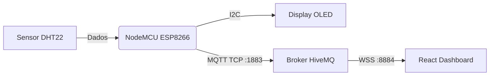

# 🌡️ Monitoramento Ambiental IoT (NodeMCU + React)


Um sistema completo de monitoramento de temperatura e umidade em tempo real. O projeto coleta dados físicos usando um **NodeMCU**, exibe localmente em um display **OLED** e transmite via internet (**MQTT**) para um Dashboard moderno desenvolvido em **React**, hospedado na Vercel.

---

## 📸 Demonstração

### Circuito Físico


### Dashboard Web


---

## 🏗️ Arquitetura do Sistema

O diferencial deste projeto é a comunicação híbrida entre Hardware e Web usando o protocolo MQTT:

1.  **NodeMCU (C++):** Lê o sensor DHT22 e publica dados via **TCP** na porta `1883`.
2.  **HiveMQ (Broker):** Recebe os dados e faz a ponte.
3.  **React (JS):** Conecta ao Broker via **WebSockets Seguros (WSS)** na porta `8884` para exibir os dados no navegador sem precisar de backend tradicional.


## 🧰 Hardware Utilizado

* **Microcontrolador:** NodeMCU v3 (ESP-12E)
* **Sensor:** DHT22 (Temperatura e Umidade)
* **Display:** OLED 0.96" I2C (Driver SSD1306)
* **Resistores:** 2x 10kΩ em paralelo (equivalente a 5kΩ).
    > *Nota: Associação utilizada para substituir o resistor padrão de 4.7kΩ (Pull-Up).*
* **Outros:** Cabos Jumpers e Protoboard.

---

## 🔌 Pinagem (Connections)

| Componente | Pino do Componente | Pino do NodeMCU (GPIO) |
| :--- | :--- | :--- |
| **DHT22** | VCC | 3.3V |
| | DATA | D3 (GPIO 0) |
| | GND | GND |
| **OLED** | VCC | 3.3V |
| | GND | GND |
| | SCL | D1 (GPIO 5) |
| | SDA | D2 (GPIO 4) |

---

## 💻 Tecnologias e Bibliotecas

### Firmware (C++ / Arduino IDE)
* `ESP8266WiFi`: Conexão Wi-Fi.
* `PubSubClient`: Cliente MQTT leve para microcontroladores.
* `Adafruit_SSD1306` & `Adafruit_GFX`: Controle gráfico do display.
* `DHT sensor library`: Leitura precisa do sensor.

### Frontend (React.js)
* **React Hooks:** Gerenciamento de estado (`useState`) e ciclo de vida (`useEffect`).
* **MQTT.js:** Cliente MQTT compatível com WebSockets para o navegador.
* **CSS3:** Layout responsivo com Flexbox, Cards UI e indicadores de status dinâmicos.

---

## 🚀 Como Rodar o Projeto Localmente

### Pré-requisitos
* Node.js instalado.
* Arduino IDE configurado para placas ESP8266.

### 1. Configurando o Hardware (Firmware)
1.  Abra a pasta `/firmware` no Arduino IDE.
2.  Instale as bibliotecas necessárias pelo Gerenciador de Bibliotecas.
3.  Edite as variáveis `ssid` e `password` com suas credenciais de Wi-Fi.
4.  Faça o upload para a placa NodeMCU.

### 2. Rodando o Site (Frontend)
1.  Abra o terminal na pasta `/frontend`:
    ```bash
    cd frontend
    ```
2.  Instale as dependências:
    ```bash
    npm install
    ```
3.  Inicie o servidor de desenvolvimento:
    ```bash
    npm start
    ```
4.  Acesse `http://localhost:3000` no navegador.

---

## ☁️ Deploy

O frontend foi implantado automaticamente usando a **Vercel**, conectada a este repositório no GitHub.

* **Link do projeto online:** [[Termometro IoT](https://projeto-iot-monitoramento.vercel.app/)]

---

## 📝 Autor

Desenvolvido por **Gustavo Correa**.

Projeto criado para estudos de IoT, Eletrônica e Desenvolvimento Full Stack.

[](https://www.linkedin.com/in/gustavo-correa-5b102a248/)
